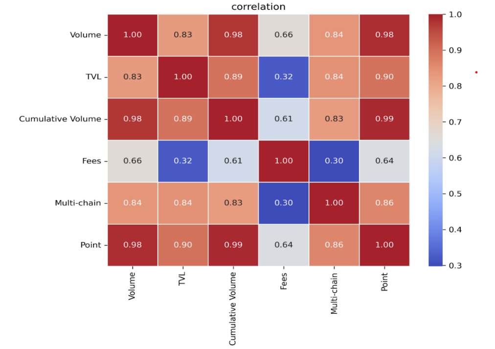
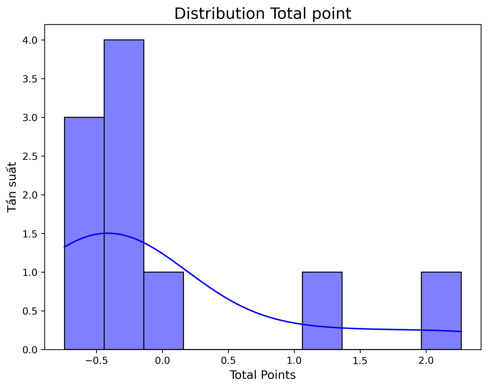
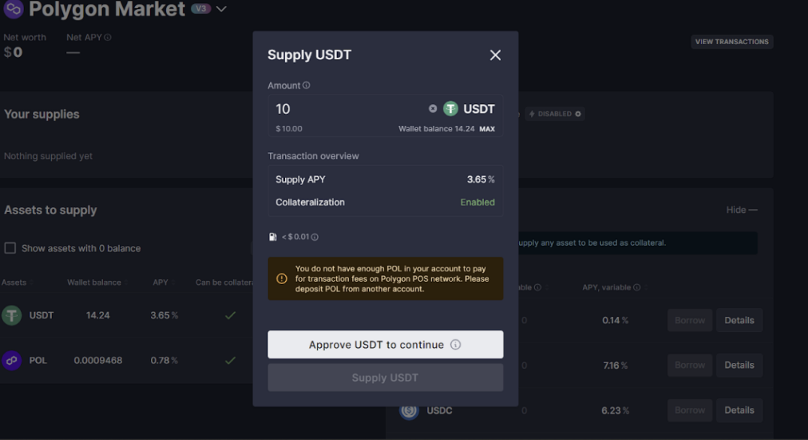
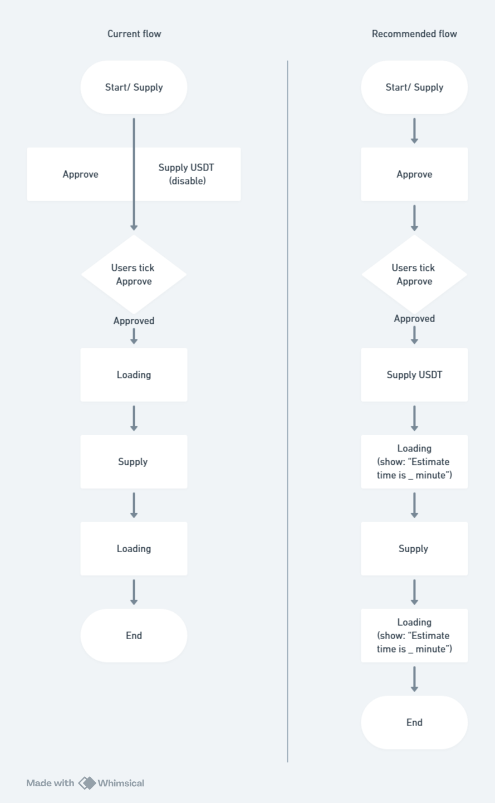

# Top 3 DEX

## Evaluation Criteria

| Criteria             | Description                                                                 |
|----------------------|-----------------------------------------------------------------------------|
| Volume (1M)          | Total trading volume in one month (USD)                                     |
| TVL (Total Value Locked) | Total value of assets locked in the liquidity pools                      |
| Cumulative Volume    | Total accumulated trading volume since inception                            |
| Multi-chain          | Operates across multiple blockchains (ETH, BNB Chain, Solana...)            |
| Fees                 | Transaction and gas fees (excluded from model due to weak correlation)      |

## Data Summary

| Variable         | Type              | Unit   | Data Source   |
|------------------|-------------------|--------|----------------|
| Total Point/Rank | Dependent         | Point (mean = 0) | -          |
| Volume (1M)      | Independent       | USD    | Defillama     |
| TVL              | Independent       | USD    | Defillama     |
| Cumulative Volume| Independent       | USD    | Defillama     |
| Fees (30D)       | Independent       | USD    | Defillama     |
| Multi-chain      | Independent       | Amount | Defillama     |

## Correlation Analysis

- Volume, TVL, and Cumulative Volume have a very strong correlation with the Total Point (coefficient 0.98–0.99). → These are the key factors determining the ranking of the DEX.
- Multi-chain has a strong correlation with Total Point (0.86), Volume (0.84), and TVL (0.84). → The ability to support multiple blockchains helps increase liquidity and expand the market.
- Fees have a weak correlation with Total Point (0.64) and almost no correlation with TVL (0.32) or Multi-chain (0.30) → It is reasonable to exclude Fees from the ranking model as it does not contribute significantly to the Total Point.

## Z-score and Total Point Calculation

**Formula:** Total Point = (Volume * 40%) + (TVL * 30%) + (Cumulative Volume * 20%) + (Multi-chain * 10%)

**Top 3 DEXs:**

| Rank | DEX         | Total Point |
|------|-------------|-------------|
| 1 | **Uniswap**  | 2.2662      |
| 2 | PancakeSwap | 1.1264      |
| 3 | Raydium     | -0.1042     |

- Only 2 out of 10 DEXs achieved a Total Point ≥1.0, with Uniswap taking a clear lead (2.26), followed by PancakeSwap with 1.1264 points. These two DEXs are also the dominant exchanges in the market with a significant ability to attract volume

---

# Competitive Advantage Analysis

## 1. 🔧 TECHNOLOGY

| Feature                 | Uniswap                               | PancakeSwap                           | Raydium                                     | Notes                                                   |
|-------------------------|----------------------------------------|----------------------------------------|---------------------------------------------|----------------------------------------------------------|
| Protocol                | AMM (v2: x*y=k, v3: concentrated)      | AMM (v2: x*y=k, v3-like)               | Hybrid (AMM + Order book)                   |                                                         |
| Cross-Chain             | ✅ Yes                                  | ✅ Yes                                  | Limited (only via Wormhole on Solana)     |                                                         |
| Smart Contract Audit    | ✅ Yes                                  | ✅ Yes                                  | ✅ Yes                                       |                                                         |
| Layer-2 Support         | ✅ Yes                                  | ✅ Yes                                  | ❌ No                                        | Solana is fast, no need for Layer-2                     |
| Integrated Oracle       | ❌ No                                   | ❌ No                                   | ✅ Yes                                       |                                                         |
| Open Source             | ✅ Yes                                  | ✅ Yes                                  | ✅ Yes                                       |                                                         |
| Integration with dApp   | ✅ Public SDK + API                    | ✅ Public SDK + API                    | ✅ Public SDK + API                         |                                                         |
| Staking                 | ✅ Yes                                  | ✅ Yes                                  | ✅ Yes                                       |                                                         |
| Farming                 | ✅ Limited                              | ✅ Yes                                  | ✅ Yes                                       |                                                         |

**Uniswap**
- Advantage: Deep liquidity (thanks to the Ethereum ecosystem), advanced AMM protocol (V3 - concentrated liquidity), and multi-chain support.\
➡️Focused on technological innovation (V3 optimizing capital) and Layer-2 integration, demonstrating a leadership spirit aimed at professional users who seek high performance and transparency.
**Pancake**
- Advantage: BNB Chain offers low costs.\
➡️Focused on innovation and diversity
**Raydium**
Advantage: Extremely fast transaction speed (Solana), hybrid AMM + order book addresses some weaknesses of both AMM protocols for speed and performance, while the order book reduces slippage.\
➡️Emphasizing performance and speed.

---

## 2. LIQUIDITY & VOLUME

| Metric      | Uniswap                        | PancakeSwap                    | Raydium                            |
|-------------|--------------------------------|--------------------------------|------------------------------------|
| TVL         | ~$3.8B (33 chains, mainly ETH) | ~$1.6B (9 chains, mainly BNB)  | ~$1B (mainly Solana)               |
| Weekly Volume | ~$50B                          | ~$43B                          | ~$12B                              |
| Slippage    | Low for major pairs, high for small ones | Low for majors, high for small caps | Very low (thanks to Solana speed) |

- **Uniswap**: Deep liquidity on major and diverse chains thanks to multi-chain integration.
- **PancakeSwap**: High volume due to low gas fees.\
➡️Attracts retail traders, especially Gen Z and Gen Y who love meme coins.
- **Raydium**: Fast, minimal slippage → *Best for Solana users*
High performance, low slippage.\
➡️  Attracts the majority of the Solana community.
---

## 3. UX/UI & PRODUCT DESIGN

| Feature     | Uniswap                            | PancakeSwap                               | Raydium                            |
|-------------|-------------------------------------|--------------------------------------------|------------------------------------|
| UX/UI       | Minimalist, intuitive               | Colorful, gamified, feature-rich           | Clean, fast, no animation          |
| Focus       | Simple swap                         | Swap + TWAP + Limit Orders                 | Speed + Performance                |
| Gamification| ❌ None                              | ✅ Yes (team battle, points, NFTs)          | ✅ Yes (leaderboard staking)       |
| Mobile App  | ✅ Yes                               | ✅ Yes                                     | ✅ Yes                             |

- **Uniswap**: Minimalism helps users focus on trading\
➡️Reflects a professional spirit to attract a large trader customer base
- **PancakeSwap**: Many features and competition → Retains users, flexible and suits the style of younger users\
➡️Aligns with the "innovative, approachable" spirit of PancakeSwap, further boosted by low fees and high volume.
- **Raydium**: Minimalist interface, no animation to optimize speed\
➡️Suits the spirit of Solana-ers who appreciate modernity, performance, and speed.

---

## 4. MARKETING & COMMUNITY

| Feature     | Uniswap                               | PancakeSwap                                | Raydium                            |
|-------------|----------------------------------------|---------------------------------------------|------------------------------------|
| Airdrop     | ✅ Rare, impactful (e.g., 2020 event)   | ✅ Frequent, through events/programs         | Only early stage                 |
| Campaigns   | Few                                    | Many, multi-platform                        | Moderate                           |
| Influencers | Organic/community-driven               | Paid collaborations                          | Paid collaborations                |
| Community   | Active                                 | Active                                       | Active                             |

**Uniswap**
- Advantage: While large airdrop events are rare, they create a significant impact on the DeFi ecosystem. Few marketing campaigns, but strong community support.\
➡️The communication advantage stems from the brand's early positioning and the impactful innovations in technology.
**Pancake**
- Advantage: Continuous strategy to attract and retain users through airdrop events, with programs that appeal to younger users and newcomers.\
➡️The communication advantage lies in the proactive and diverse methods of customer retention through rewards.
**Raydium**
- Advantage: Airdrop campaigns, although implemented only in the early stages, created a momentum that attracted a large portion of Solana users.\
➡️The communication advantage lies in the focus on the Solana ecosystem, complementing the benefits of speed and low slippage.

## UX Issue 1:
For new users, after clicking the Supply button for a token, two options appear simultaneously: **"Approve"** and **"Supply [USDT]** (disabled)".\
The interface displays the Supply button even when the Approve step hasn't been completed, which can be confusing.
This causes users to expect they can supply immediately, but then they get stuck.\
➡️ Users may drop off right at this step.\
illustrate image: 

##Issue 2: Waiting time when performing “Supply” takes around 1–2 minutes (e.g. supplying USDT on Polygon network).\
This is technically normal since the waiting time depends on the chain. However, it can frustrate new users → they may leave in the middle of the process\
➡️(1) Users cancel the transaction and leave\
➡️(2) The platform continues to process while users start another transaction → leads to wasted gas for users.

## Recomendation

